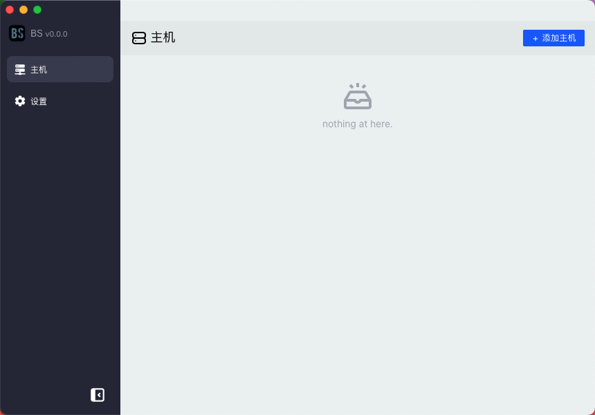

# BS Redis Desktop Client n

English | [中文](./docs/zh_CN.md)

> BS Redis Desktop Client tauri

> The BS redis desktop client is powered by Rust and Tauri, with very small weight, beautiful interface and faster
> running speed!


## Screenshots


## this project is rebuilding, if you need the old resource please check tag#1.1.1

## branch sciter is based on sciter framework,more info see sciter branch.

## Software download and communication

* Software download：[Home Page](http://bs.xsa.link)
* Communication： QQ GROUP：877290961

### Development

```shell
pnpm tauri:dev
```

### Directory tree

- `/src-tauri` is  [tauri](https://tauri.app/) rust code

### Init environment

- See [tauri guides](https://tauri.app/v1/guides/)

### build

```shell
pnpm tauri:build
```

### Other

- change app icon `pnpm tauri:gen-icon`
- redis uri see [redis uri](./docs/uri.md)


## LICENSE

[MIT](./LICENSE)
